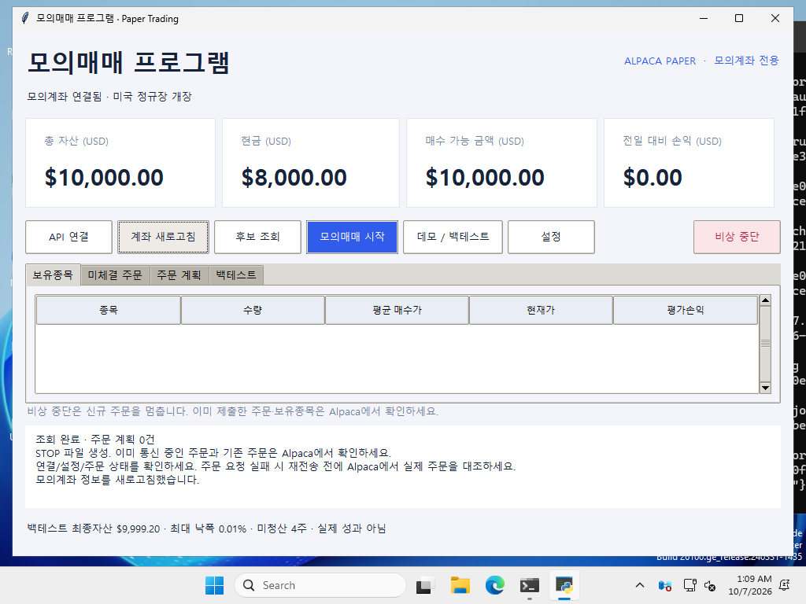

# Windows GUI 검증 결과

2026-10-07 Microsoft Windows Server 2025 / Python 3.12.10에서 실제 Tkinter 창을 실행하고 외부 마우스·키보드로 조작했습니다. Windows 11 사용자 PC에서 직접 실행한 결과는 아닙니다.

- GUI 조작 검증 13개 통과
- 기존 단위 테스트 18개 통과
- 실행 기록: https://github.com/BaekJaeYeol/paper-trading-program/actions/runs/37555606711
- 검증 대상 코드: `06d9218cdaae2531134bf51cb8a19d45ff1bcc04`

## 조작 범위

1. 창 표시 및 작은 화면에서 작업 표시줄 위에 배치
2. 계좌 요약 새로고침
3. 후보 조회 시 주문 미제출
4. 파일 선택 취소 후 기본 합성 CSV 데모
5. 전략 설정 저장
6. 잘못된 설정 거부 후 정상값 복구
7. API 입력 마스킹 및 빈 키 거부
8. 매매 시작 확인 취소 시 주문 미제출
9. 시작 확인 후 테스트 주문 제출
10. 비상 중단
11. STOP 해제 후 재개 시 중복 제출 방지
12. 테스트 통신 오류 후 조회 복구
13. 창 종료

## 발견 및 수정

고정 창 크기로 작은 Windows 화면에서 하단 로그·안내가 가려지는 문제를 수정했습니다. 화면 크기에 맞춰 초기 창 크기를 정하고 로그 영역 공간을 먼저 확보합니다.

## 검증 한계

오프라인 브로커와 합성 데이터를 사용했습니다. 실제 Alpaca 인증·시세·체결 및 실제 계좌 잔고는 검증하지 않았습니다. 테스트 프로세스는 네트워크 연결을 차단하며 계좌 주문을 전송하지 않습니다. 5분 타이머의 실제 시간 경과, EXE 빌드, Windows 11의 DPI·개인 PC 환경은 이번 검증 범위에 포함하지 않습니다.

